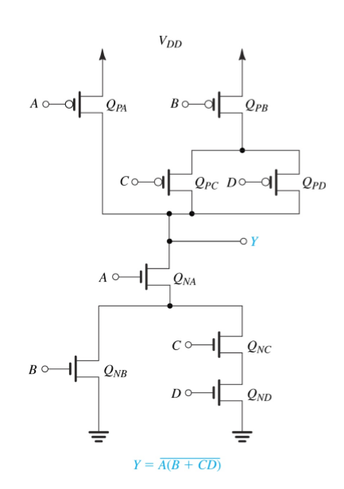
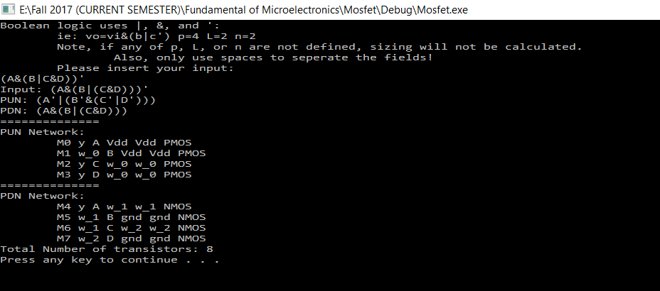
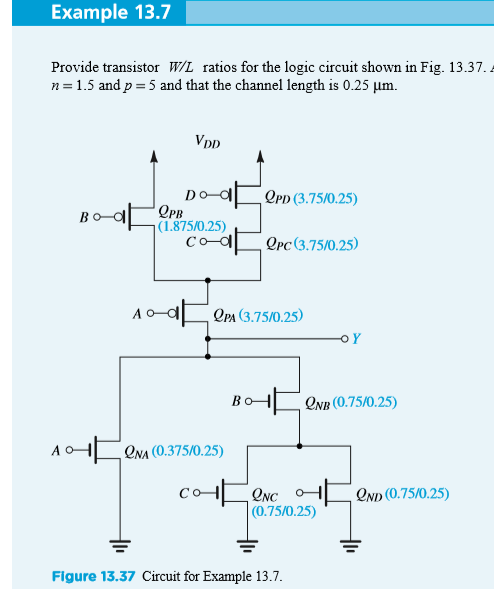
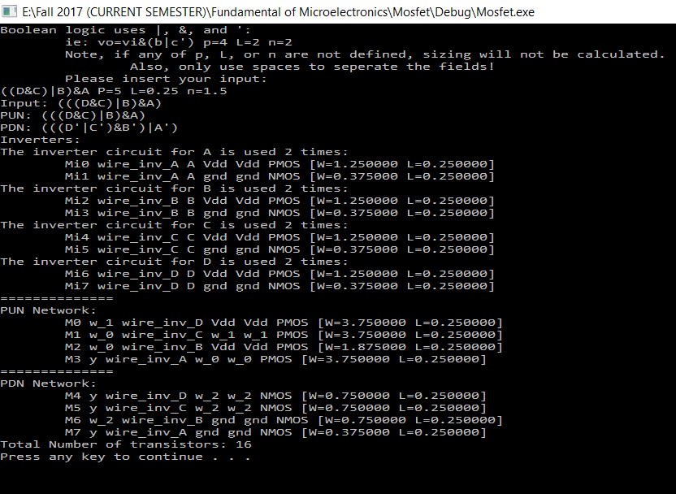

# CMOS Logic Gates Spice Simulator
## About
Extra Credit Project for **CSCE 330 Fundamental Microelectronics** at *The American University of Cairo, Fall 2017*.

Developed by:
 * Andrew Ehab
 * Ayat Allah ElAkhras
 * Karim Abdel Hamid

## Introduction and Purpose
The target of this project is to generate a CMOS logic gate Spice Description of any Boolean Expression. This description is in mainly of  the details of different transistors used in implementing that Boolean expression and the way the transistors are connected to each other. It has 2 modes of operations which are automatically chosen depending on the input of the user. If the input is just a Boolean expression, the mode of operation will be  ‘The Simple Mode’, where the output will be only the Spice description of the CMOS circuit without sizing information. While on the other hand if the user inputs the standard sizing of inverter transistors (n, p)  and the process technology (L) along with the Boolean expression, the mode of operation is automatically switched to the second mode ‘The transistor-scaling mode’ where the output is still the Spice description of the CMOS circuit but with sizing information making the delay of the gates in the circuit close to that of a CMOS inverter circuit with sizes p and n.  In both modes, the code outputs the total number of transistors used in the realization of the expression. Moreover, in both modes you’re given the option to type a path to write the Spice details (output of the code) to or just press quit and prevent writing in file.

## Building
Either download and use cmake to build a project (whether makefile, Visual Studio Project, XCode project, or otherwise), or simply create it yourself using the .cpp and .hpp files.

## Usage
Simply run the program itself. It requires no program arguments, as all input is accepted within.

Input formats are prompted in the program itself. All inputs must be written in the following way:
`[[vo=]boolean expression] [P/p]=[real number] [N/n]=[real number] [L/l]=[real number]`

For example, here are two separate program inputs:
`a&b p=4 n=2 l=1.5`
`L=2.3 n=1 P=4.5 vo=(vi&a)|b`

The boolean circuit must be formatted to use parentheses `()`, and as `&`, or as `|`, and not as `‘`.
Units for transistor sizing don’t matter, as long as they are consistent. The order of fields don’t matter. The `p`, `n`, and `l` parameters can be written in upper and lower case. These parameters respectively represent total PUN width, total PDN width, and length of transistors. The boolean expression may have an equivalence symbol, but it is not required, and may have any name. All fields can appear in any order.

Finally, a prompt will appear to output to a file, after all output appears to terminal/console. If q is inputted, no file will be outputted. Mac users must give an absolute path.

## Algorithm
The program goes through the following stages:
1. Parameter parsing
2. Conversion of boolean expression to infix text format to a binary tree.
    * Two stacks are used. One to contain new nodes, and another to contain operators.
    * Characters are read from left to right. If a not ‘ is found, the top node is popped and a Not Node is pushed to the stack, with child the popped node.
    3. If a left parenthesis “(“ is found, it is pushed to the opstack.
    * If a right parenthesis “)” is found, all opstack items are processed using doBinary until a matching parenthesis is found. 
    * If the & operator is found, doBinary is called on every operator in the opstack until an | or ( are found, or there are no more items in the opstack, and press an & to the opstack.
    * If the & operator is found, doBinary is called on every operator in the opstack until an ( is found or there are no more items in the opstack, and press an & to the opstack.
    * doBinary takes the last two nodes in the nodestack and puts the combined node into the nodestack.
    * returns the root node.
3. DeMorgan’s Law combined with inversion
    * Used to simplify expression so all complements surround the variables, so the following algorithm can be easier.
    * And gates, Or gates, and Variables all produce copies of themselves
    * Not gates invert themselves and use demorgan's law on all child nodes
    * This produces the equivalent expression, but simplified.
4) The PDN is inverted.
    * Inversion, which is included in the previous step, is computed in the following way.
    * And gates produce Or gates.
    * Or gates produce And gates.
    * Not gates produce their child nodes.
    * All variables produce not nodes with a copy of the variable as their child.
5) Mosfet output is calculated. If sizing is provided, this is done in two parallel steps recursively in the same functions:
    * In the following, assume the following variables:
        * La = Longest path of A
        * Lb = Longest path of A
        * Lab = Longest path of the node = La + Lb
    * And nodes have two inputs, A and B:
        * A wire is created.
        * A’s mosfet function is called, with input drain and the wire in between.
        * B’s mosfet function is called, with input source, and the ground.
        * The width passed to A is Lab * input width / La.
        * The width passed to B is Lab * input width / Lb.
    * Or nodes have two inputs, A and B:
        * A’s mosfet function is called, with input drain and source.
        * B’s mosfet function is called, with input drain and source.
        * The width passed to both sides is the input width.
    * Not nodes are known to only have one child, due to the previous DeMorgan step. These and variable nodes produce one mosfet, either PMOS or NMOS. If it is in the PUN and a Variable Node, or in the PDN  and a Not Node, the associated gate is flagged in a map and incremented by one if found, or set to one if it doesn’t exist, to indicate how many items exist total (used for analysis of the circuit and to create the expanded inverters later). These are also set to use a special inverter wire which will be linked to later.
6) All inverters are expanded to their equivalent circuit, including one pmos connected to Vdd and y, and one nmos transistor connected to y and gnd, with both connected to the proper variable that’s being inverted as well as the inverter output wire created in the previous step. These are given through the map, also from the previous step.

## Structure
* A “Node” Base Class
    * “InNodes” (variable), “NotNode”, “OrNode”, and “AndNode” children.
    * These all have the following methods:
        * GetType
        * Traverse
        * Invert
        * DeMorgan
        * LongestPath
        * Two Mosfet methods, one with sizing and one without
        * A << operator for use with cout.
* The Graph Converter exists as a class.

## Assumptions:
1) The output is the CMOS standard realization to the inputted expression as is. The code isn’t concerned with simplifying the expression. 
2) The dimensions of each transistor supplied in input should be of consistent units. The code doesn’t do any units conversions. 
3) The only operators considered are AND, OR, NOT where they’re expresses as &, |, ‘ respectively.
4) The code is built in a way that assumes that the precedence from highest to lowest is brackets, ‘, &, |.
5) Assume the source is connected to the body of all transistors in the circuit.
6) Each line in the output represents the details of a single transistor in the circuit showing what is connected to Drain, Gate, source, body followed by the type of transistor (PMOS if in PUN or NMOS if PDN).
7) The intermediate wires connecting transistors in the middle of the PUN or PDN are defined by w_index indicating the wire number.

## Testing Procedures:
This section is for the procedure followed in testing the 2 modes of operations:

### Simple Mode
Inputting the following expression and expecting the Spice description of the following circuit.

`Y = (A&(B|C&D))’`

The output of the code is:

### The Transistor-Scaling Mode
Inputting the following expression and details of dimensions in the following format and expecting the Spice description of the following circuit, along with sizing information; with a single space separating each of the inputs.

`Y = ((D&C)|B)&A p=5 L=0.25 n=1.5`

The output of the code is:

